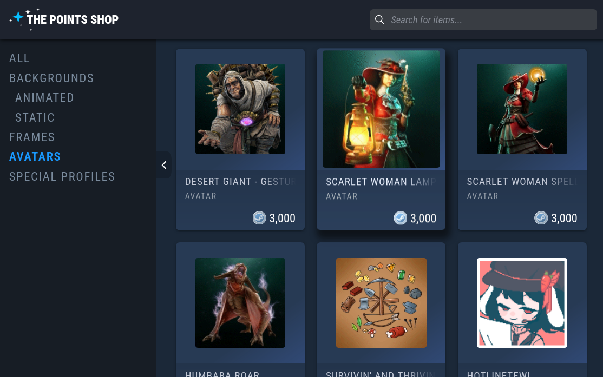

# Steam Profile Designer (WIP)

  

Steam profile Designer is a **unoffical** tool designed to help Steam users design their Steam profiles.

**It is my pet project which is still work in progress**

It also requires external API server because STEAM API doesn't have CORS policy set up.
Server code is avaliable here [steam-profile-designer-server](https://github.com/kyceblake/steam-profile-designer-server)
**Server may be down, however I planning to write the cache logic. You can host server by yourself and change api url in the settings of chrome extension**

## ToDo

- ~~An "Infinite" list of items with virtualization~~
- List virtualization
- A Settings page with an option to change API server
- A Selected Items component
- Clear cache feature
- Profile Themes color parser
- Manipulate steam profile DOM via browser extensions
- Write script for building browser extension
- CI to automate building for chrome/firefox
- Minor UI/UX tweaks
  - icons
  - additional stats

## Credits

Server uses some code from [sapic/backgroundsgallery getAllBackgrounds.ts](https://github.com/sapic/backgroundsgallery/blob/master/utils/backgrounds/getAllBackgrounds.ts)
